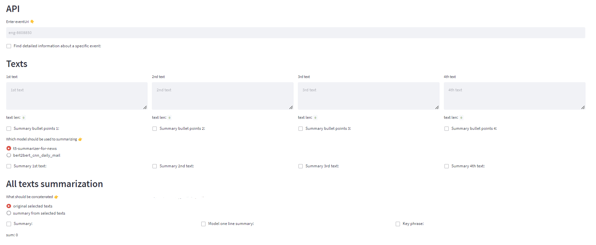
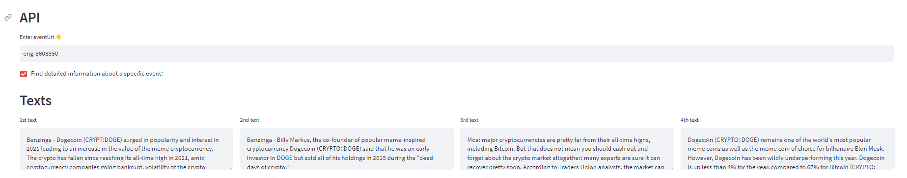
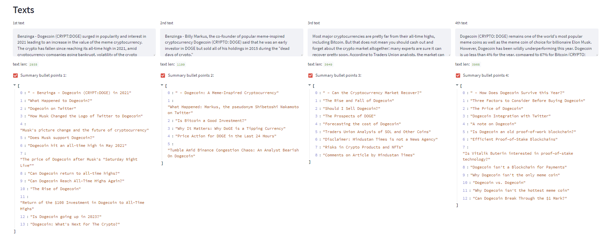
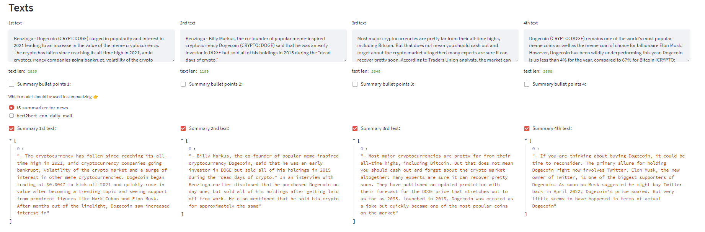
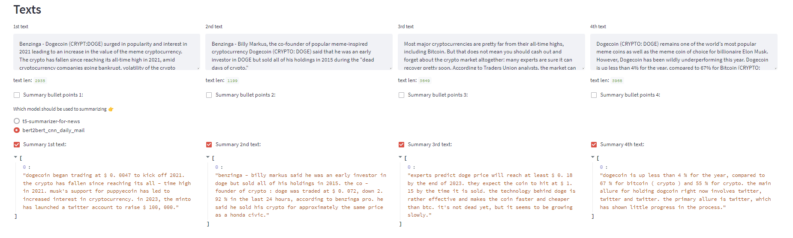
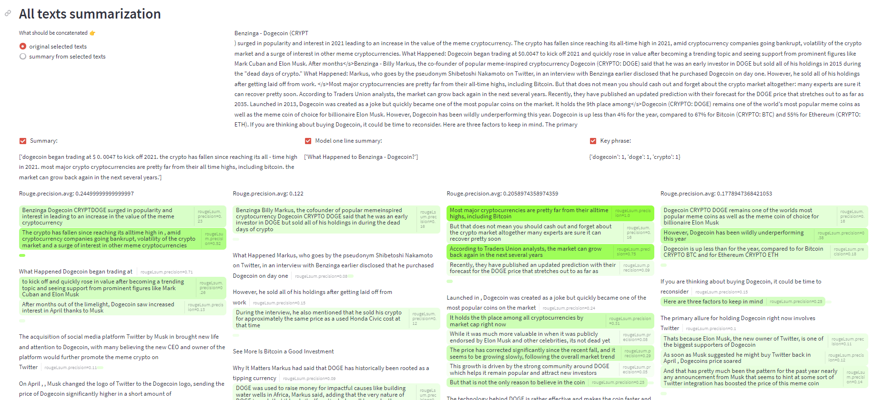
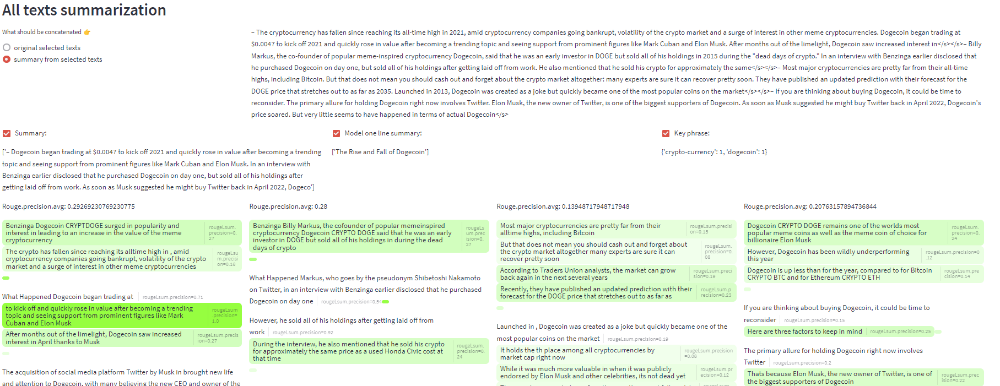
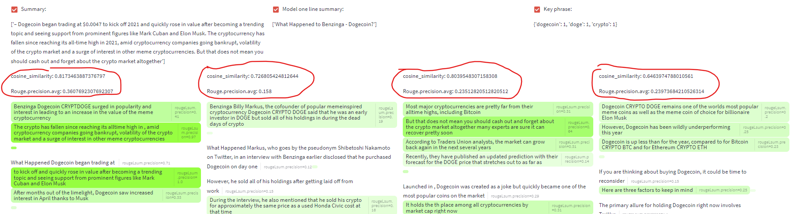

# Text summarization
Repository created as part of a collaboration between students from Wrocław University of Technology and Event Registry. The task is to create a summary of several texts, assuming that the texts come from the same event. 

For full use of scripts, yous should copy the config file from `config/config` to `config/config.local` and complete with your key.
```
[eventRegistry]
    apiKey = yourapiKey
```

### Setup env
```bash
$ python3.9 -m venv .venv
$ source .venv/bin/activate
$ pip install -r requirements.txt
```

### Demo
A prototype has been created with the help of the `Streamlit` library, to run the application you need to run:
```commandline
streamlit run experiments\scripts\streamlit_app.py
```


You can use the APIs provided by Event Registry to slap together 4 similar texts. All needed information you can find under the link:
https://github.com/EventRegistry/event-registry-python/wiki/Get-event-information. We use four the most important articles in event (with `sortBy: sourceImportance`).
 Remember to use the key in the `config/config.local` file.
#


If you don't want to use the api, and you are sure that the 4 texts are similar/refer to the same event you can simply paste them in the spaces provided. You can find example texts in `data_input_streamlit_example`.

Remember to use the key in the `config/config.local` file.
Tip: To find `event_id` (`eventUri`) you can use implemented by us script: `experiment\scripts\download_data.py`. For example, you can look for some topic using `recently_added`).

From each text you can get short summaries of paragraphs (or sections, depending on how the text is divided - this is a hyperparameter).


It is possible to summarize a single text with the help of two models:
- `anikethdev/t5-summarizer-for-news`



- `bert2bert_cnn_daily_mail`


You can then summarize all 4 texts, we suggest two options:
- summary, which is formed from the concatenation of the original texts (`original selected texts`):

- bert:


or 
- summary, which is formed from the concatenation of the summaries of texts (`summary from selected texts`):

- t5:


Concatenated text includes 128 tokens from each text (article/article's summary). 

From our observations (looking at the rouge and cosine similarity metric), generative models work better than bert, and do a bit better at creating a summary based on the original texts (that is, we accept the loss of much of the text with the idea that the most important is at the top of the article).



# Scripts
We have implemented several scripts that can help analyze the problem. They can be found in `experiment\scripts`. Configuration of the models and datasets used by model is implemented in the `experiments\config\model.yaml` --output_dir.

For example to create texts summary (using model and dataset defined by `summarizer_for_news` in `experiments/config/models.yaml`) run:
```bash
$ python experiment\scripts\text_summary.py --hparams_path experiments/config/models.yaml --model summarizer_for_news  --output_dir  output
```
since this configuration is default configuration you can simply run:
```bash
$ python experiment\scripts\text_summary.py
```

# Used methods

## Bullet point summarization

This methodology involves segmenting the articles into bullet points in order to condense their content. The pipeline can be broken down into two primary steps:

1. Segmentation of the text into single paragraphs
2. Summarization of each paragraph into a concise bullet point.

Text segmentation into paragraphs can be achieved through either semantic or lexical means. Semantic splitting, while ideal for summarization, can be challenging to implement. With the use of the EventRegistry API, article division can be accomplished through the inclusion of an empty line character (`\n\n`) or HTML tags such as `\<p\>` when scrapping the data. More advanced machine learning techniques require further research and testing, particularly in terms of efficiency.

Lexical splitting, on the other hand, is a more simplistic approach, which can be done with the division of the text into `n` equal chunks of words. A superior alternative would be to divide the text into sentences, although this method necessitates greater effort than separating the text by dots.

Existing pretrained models, such as `snrspeaks/t5-one-line-summary` or `anikethdev/t5-summarizer-for-news`, can be efficiently utilized for the summarization component. For multi-lingual applications, the `mT5` model, such as `ctu-aic/mt5-base-multilingual-summarization-multilarge-cs`, should be considered but will need to undergo testing.
